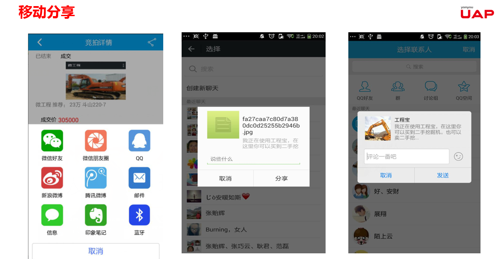

#移动接入
移动平台提供扩展接口，支持多种类型的移动接入，其他开发者可以以组件的形式，直接引入到项目。

##微应用
微信给商家提供了一个新的营销渠道，提供了一个从线上汇集顾客的方式。mobile开发平台提供H5 开发，支持微应用网站接入；另外移动应用服务器MA Server集成微信开发的常用接，开发者可以快速开发微应用。
以下为某客户试用iuap mobile 平台开发的微应用案例。

##移动支付
移动支付已经成为移动互联网基础设施的关键节点，平台提供扩展机制，可实现多种移动支付方式：

##移动导航
在APP或者微应用中，可集成高德、百度等地图，方便定位、导航

##移动分享
利用分享功能分享至各种主流社交平台，扩大影响力。

##移动审批
业务集成，实现业务跨终端，提高企业运转效率

##AR、VR物联网接入
如下是用友iuap在刚刚闭幕的2016中国企业互联网大会上成功对外展示的AR／VR在工业智能制造与维修领域的应用场景。

本场景演示，模拟了一个车间，通过AR应用能实时监控车间的生产、设备、环境、能耗等数据。能对整个生产实时监控，并能实现异常预警。场景中，有生产单元-计米器累计数表示产量，计米器的状态开关可以在故障报警后恢复生产，通过电表统计能耗、监控设备运行的电流电压等。温度计、光感仪监控会输出环境参数。

通过这个场景演示，用友iuap mobile通过AR技术，操控者不再仅仅面对枯燥的数据报表，可以更加生动形象、实时的掌控生产环境以及生产进度，当发生故障时，可以及时获取预警信息，并可在辅助信息的指引下，排除故障。

该场景为制造型企业带来了如下商业价值：
1.	员工可通过任意带有摄像头的移动端（可穿戴）设备，对真实工业设备进行扫描识别，并在真实物体上叠加出该物体的运行态实时数据；便利了员工了解设备的实时运行情况。
2.	降低新老员工设备维修知识的传递成本。
3.	足不出户，只需通过移动端设备对真实工业设备的照片进行扫描，即可得知该工业设备的当前真实运转情况，大大降低了设备巡检的成本。

iuap mobile AR/VR平台抽取了AR／VR实现中的关键技术，内置到平台中，减少了AR／VR开发的难度，让新技术更好的服务于企业。

